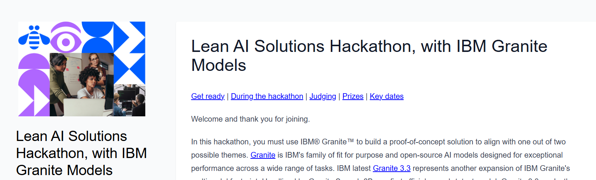
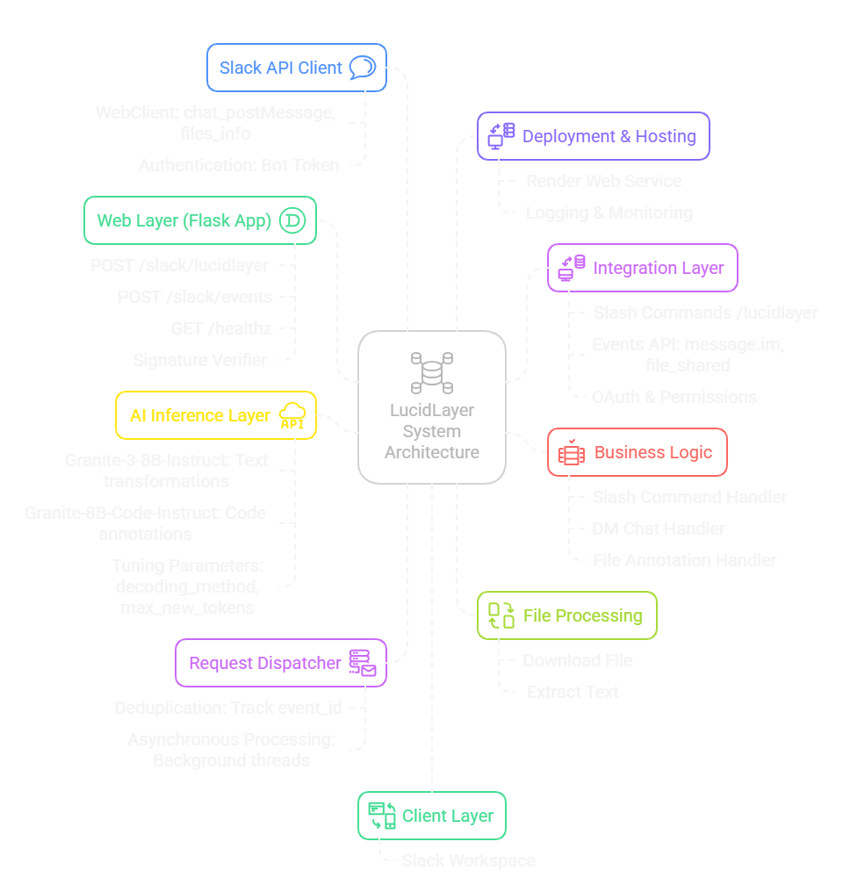
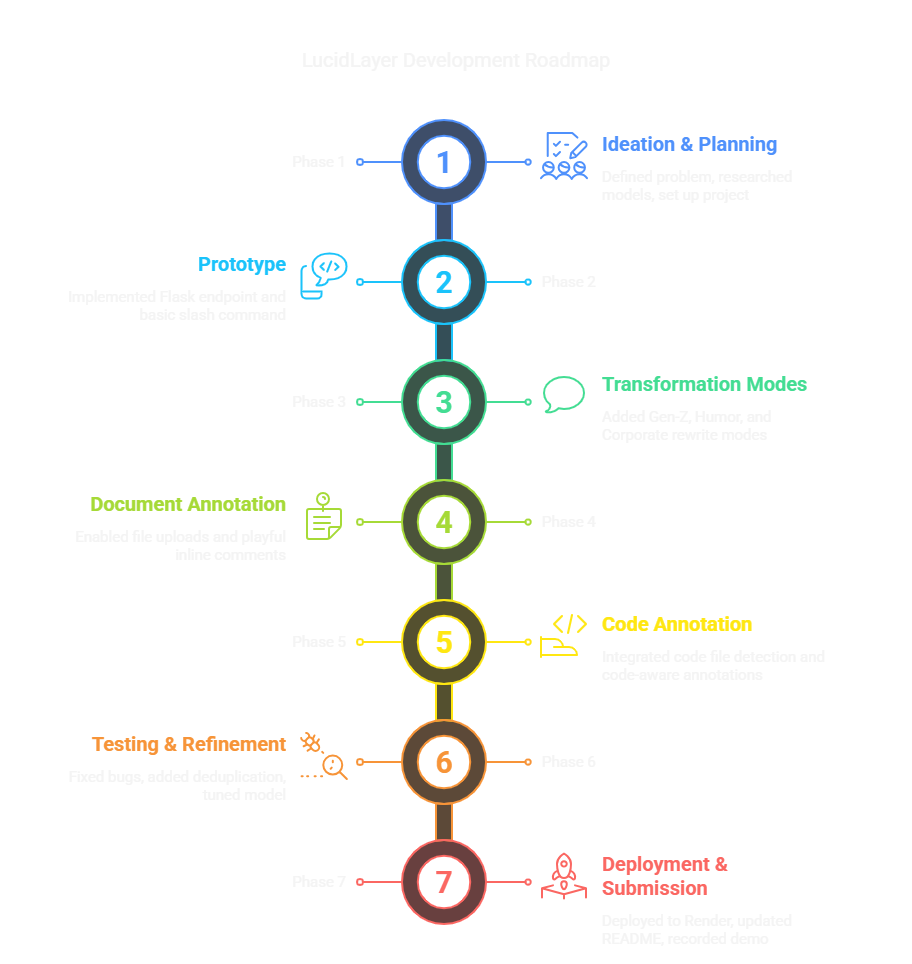
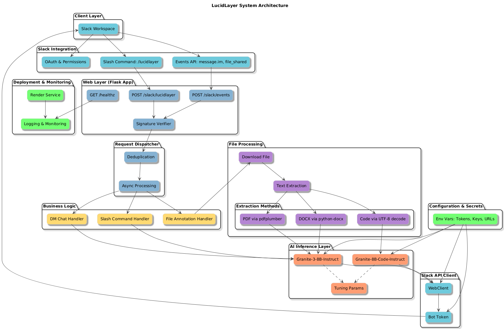

# LucidLayer

[About](#about) | [Features](#features) | [How It Works](#how-it-works) | [Installation](#installation--local-setup) | [Roadmap](#project-roadmap) | [Architecture](#architecture) | [Contact](#contact)

  

LucidLayer is an AI-powered Slack assistant designed to make daily communication more engaging, creative, and human. By leveraging IBM's Granite models, LucidLayer simplifies corporate jargon, adds humor, and helps teams express their ideas in a clearer, more accessible manner. Whether you're dealing with boring reports, long emails, or dry presentations, LucidLayer turns the mundane into something more delightful.

## **Hackathon Theme: "Make Work Less Boring"**

**LucidLayer's mission aligns perfectly with the hackathon theme —** we aim to *inject creativity into the day-to-day business operations*, reducing the friction and formality of internal communication, and fostering a more innovative, open, and collaborative work environment.



---

### <a id="about"></a>**How LucidLayer Addresses the Theme**

By simplifying, humanizing, and adding fun to communication, LucidLayer enhances team creativity and innovation by:

- **Transforming corporate jargon** into clear, digestible language.
- **Adding humor and simplification** to messages, reducing friction and improving engagement.
- **Offering Slack slash commands and document annotation** to make reports and discussions more playful.
- **Providing message transformation buttons** to retrofit creativity into old content.
- **Leveraging IBM Granite** to deliver context-aware, creative outputs tailored to user tone.

---

### <a id="features"></a>**✨ Features**



✅ **Slack integration** with slash commands and message transformation  
✅ **AI-powered message transformation** (simple, humor, Gen-Z, corporate)  
✅ **Message transformation button** for Slack messages  
✅ **Document and code file handling** via DM (PDF, DOCX, TXT, Python, Java, etc.)  
✅ **IBM Granite model integration** for all text transformations  
✅ **Production-ready backend** implemented using Flask  
✅ **Deployed and live** on Render at [https://lucidlayer.onrender.com](https://lucidlayer.onrender.com)  
✅ **Ready for Slack App Directory** submission

---

### ⏳ **Future Scope**

- Publish to the Slack App Directory for wider adoption
- Add personalized tone options based on team preferences
- Integrate with more platforms (Microsoft Teams, Discord)
- Develop a browser extension for web-based communication
- Create an API for third-party integrations

---

### <a id="project-roadmap"></a>**🗺️ Project Roadmap**



LucidLayer followed a structured development path from concept to completion:

**Phase 1: Ideation & Planning** - Defined the core problem (overly formal, jargon‑laden internal comms), researched IBM Watsonx Granite foundation models, and set up the project infrastructure.

**Phase 2: Slash Command Prototype** - Implemented the /lucidlayer Flask endpoint, built initial prompt logic for the "simple" rewrite mode, and tested the basic slash‑command flow end‑to‑end.

**Phase 3: Text Transformation Modes** - Added Gen‑Z ("genz") and Humor modes, introduced Corporate mode for professional rewrites, and iteratively refined all prompts based on user feedback.

**Phase 4: Document Annotation** - Enabled DM‑based file uploads (PDF, DOCX, TXT), extracted text using pdfplumber and python‑docx, and hooked it into granite‑3‑8b‑instruct for inline comments.

**Phase 5: Code Annotation** - Detected code file types (.py, .js, etc.) in DMs, integrated the granite‑8b‑code‑instruct model, and generated inline reviewer notes that both explain and amuse.

**Phase 6: Testing & Refinement** - Added event deduplication, fixed edge‑case bugs, and tuned model parameters for speed and clarity based on user feedback.

**Phase 7: Deployment & Submission** - Configured Render deployment, updated documentation, and prepared all hackathon deliverables.

---

### <a id="how-it-works"></a>**🧠 How It Works**

1. **Interact via Slack**: Use `/lucidlayer` or DM the bot with text or a file.
2. **Choose a Tone**: Specify a style like "humor", "simple", "corporate", or "genz".
3. **AI-Powered Rewriting**: Content is sent to IBM Granite and rewritten in that tone.
4. **Receive Response**: The revised message or annotated file is returned in Slack.

---

### <a id="architecture"></a>**🏗️ Architecture**



LucidLayer implements a multi-layered architecture that handles the flow from Slack user interactions through to AI-powered responses. The system begins at the Client Layer with the Slack Workspace, which connects to the Slack Integration layer (handling slash commands, events API, and OAuth). The Web Layer uses Flask to process incoming HTTP requests, verified through a Signature Verifier. A Request Dispatcher ensures proper deduplication and async processing, passing requests to the appropriate Business Logic handler (slash commands, DMs, or files). For files, specialized extraction methods handle different formats (PDF, DOCX, code). The AI Inference Layer leverages IBM's Granite models (3-8B-Instruct and 8B-Code-Instruct) with tuned parameters, while the Slack API Client handles responses back to users. The entire system is configured through environment variables and deployed on Render with appropriate monitoring.

---

### **💥 Impact on Creativity & Innovation**

LucidLayer is more than a bot — it's your team's creative sidekick:

- **Boosts Innovation**: Removes communication barriers through clarity and creativity.
- **Promotes Inclusion**: Translates overly formal language into accessible content.
- **Makes Work Fun**: Adds a layer of humor to documents, chats, and brainstorming.

---

### **🧩 How to Use on Slack**

1. **Set up**: Install LucidLayer into your Slack workspace by following the integration steps.
2. **Slash Command**: Use the `/lucidlayer` command followed by your message. Optionally, specify a transformation mode (simple, genz, humor, corporate).
3. **Document Upload**: Upload documents or code files, and LucidLayer will provide a witty, simplified, or humorous version.

### **Requirements**

- Slack workspace
- IBM API credentials (Granite model)
---

### <a id="installation--local-setup"></a>**🚀 Installation & Local Setup**

#### 1. **Clone the Repo**
```bash
git clone https://github.com/your-org/lucidlayer.git
cd lucidlayer
```

#### 2. Install Dependencies
```bash
pip install -r requirements.txt
```

#### 3. Configure Environment
- Create a .env file with:
```bash
SLACK_BOT_TOKEN=your-slack-bot-token
SLACK_SIGNING_SECRET=your-signing-secret
WATSONX_URL=your-watsonx-url
WATSONX_APIKEY=your-watsonx-apikey
PROJECT_ID=your-watsonx-project-id
```

#### 4. Run Locally
```bash
python main.py
```
To expose locally via ngrok:
```bash
ngrok http 5000
```
Update your Slack app's event and command URLs to match the ngrok HTTPS URL.

#### 5. Deploy on Render
- Connect this repo to Render.
- Set build command: pip install -r requirements.txt
- Set start command: python main.py
- Add environment variables via Render dashboard.
- Access the deployed application at: [https://lucidlayer.onrender.com](https://lucidlayer.onrender.com)

### **Requirements**
- Slack workspace with a custom app installed
- IBM API credentials (Granite model via watsonx.ai)
- Python 3.8+
- Flask

### **License**
This project is licensed under the MIT License.

---

### <a id="contact"></a>**Contact**
For further information or contributions, please reach out to [arpitsinghgautam777@gmail.com](mailto:arpitsinghgautam777@gmail.com).